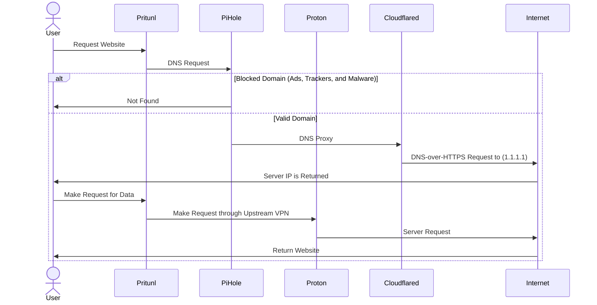

# PPP(C)
PPP stands for Pritunl, Pi-hole, Proton VPN (and Cloudflared). The main goal is to increase security and improve privacy protections for users that may be in different physical locations. By using a Pritunl VPN, PPP aims to share a Pi-hole configuration among multiple users. Therefore, as well as the usual benefits of using a VPN, PPP automatically includes ad, tracker, and malware blocking. Upstream DNS requests from the Pi-hole are made over HTTPS using Cloudflared. Connections are further routed through an upstream Proton VPN server for additional IP obfuscation.

## Installation
PPP is designed to be run through docker containers (using docker-compose).

### Building
The following environment variables should be defined in your shell, or even better, in a `.env` file before trying to build. The variables that should be defined are listed below:

| Variable            | Description              |
|---------------------|--------------------------|
| PROTONVPN_USER      | OpenVPN / IKEv2 username |
| PROTONVPN_PASSWORD  | OpenVPN / IKEv2 password |
| PROTONVPN_PLAN      | ProtonVPN Plan: <br> 1 for Free <br> 2 for Basic <br> 3 for Plus <br> 4 for Visionary |
| PROTONVPN_PROTOCOL  | ProtonVPN Protocol: <br> 1 for UDP <br> 2 for TCP |
| PIHOLE_PASSWORD     | Password for Pi-hole     |
| PIHOLE_VIRTUAL_HOST | Server host name         |

Once all variables have been set, run
```
make build
```
to build all containers.

### Running
Run
```
make up
```
to bring up all containers.

## Data Flow


## BYO (Bring Your Own) VPN
Even though PPP was built around using ProtonVPN as the upstream VPN, it should be possible to use any VPN. The structure of the docker-compose.yml is designed to be overridden. Knowledge of docker-compose will be helpful here but is not strictly required. Do the following:

1. Create a new docker-compose config using docker-compose.proton.yml as a guide. The most import part is to update the `command` with whatever command is used to start the VPN.

2. In the Makefile, set DOCKER_OVERRIDE to the name of the file created in the previous step.
